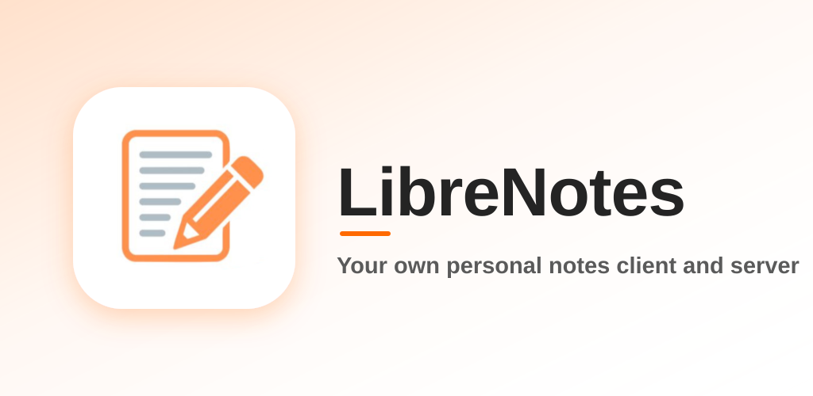

<p align="center">
  
</p>

<p align="center">
  <a href="https://github.com/Piliii/LibreNotes/actions/workflows/ci.yml"></a>
  <a href="https://github.com/Piliii/LibreNotes/releases/latest"></a>
  <a href="LICENSE"></a>
  <a href="https://f-droid.org/packages/dev.librenotes.app/"></a>
</p>

<p align="center">
  A private, self-hosted, end-to-end encrypted note-taking app.<br/>
  One owner, many devices. The server stores only ciphertext.
</p>

<p align="center">
  <a href="https://f-droid.org/packages/dev.librenotes.app/"></a>
  <a href="https://play.google.com/store/apps/details?id=dev.librenotes.app"></a>
</p>

<p align="center">
  <a href="https://librenotes.ayopili.com">Website</a> ·
  <a href="https://librenotes.ayopili.com/docs">Docs</a> ·
  <a href="CHANGELOG.md">Changelog</a> ·
  <a href="CONTRIBUTING.md">Contributing</a>
</p>

**Platforms:** Android (F-Droid, Google Play), Linux desktop, Windows desktop

## Why LibreNotes?

Most note apps make you choose between convenience and control. LibreNotes
is built so you don't have to.

- **Your server, your data.** Sync runs on a small server you host yourself,
  on a home LAN or a Tailscale/WireGuard mesh. There is no account, no
  vendor cloud, and nothing is sent to the developer.
- **The server can't read your notes.** Everything is encrypted on your device
  before it leaves, so the server only ever holds ciphertext. A new device
  needs only your passphrase to unlock.
- **Works fully offline.** Every device keeps a local, encrypted store and
  syncs whenever the server is reachable. The app never waits on the network.
- **You decide conflicts.** There is no CRDT magic. If two devices edit the
  same note, you see both versions and pick the winner.
- **Plain markdown, no lock-in.** Notes are ordinary markdown, and you can
  export them all as `.md` files at any time.
- **Genuinely free software.** AGPLv3, no trackers, no Google Play Services,
  and no Electron. The desktop app is native Flutter.

## Features

- Markdown notes with live preview
- Dark theme, orange accent, resizable sidebar
- Offline-first: full local cache, syncs opportunistically
- End-to-end encryption (XChaCha20-Poly1305 + Argon2id key derivation),
  plus encryption of notes at rest on each device
- Conflict resolution: server detects stale writes and returns both versions; you pick the winner
- Archive, and a trash bin with restore and permanent delete
- Text highlighting, custom and gradient note colors
- Self-destructing notes, and quick capture with a global hotkey on Linux
- Markdown import and export
- Self-hosted sync server (Shelf + SQLite, single compiled binary or Docker image)

## Repository layout

```
packages/notally_core/   Shared Dart models + sync DTOs (app + server)
server/                  Sync server (Shelf + SQLite, E2EE-blind)
clients/app/             Flutter client (Android, Linux desktop, web)
assets/icon/             Source app icon
```

## Quick start

### Server

```bash
cd server
dart pub get
dart run bin/server.dart
```

The server prints a bearer token on first start and binds to `0.0.0.0:8787`.
See [server/README.md](server/README.md) for full configuration and API docs.

### Client

```bash
cd clients/app
flutter pub get
flutter run -d linux          # Linux desktop
flutter run -d chrome         # web
flutter run                   # Android (device/emulator attached)
```

The Flutter SDK must be on PATH:

```bash
export PATH="$PATH:/path/to/flutter/bin"
```

See [clients/app/README.md](clients/app/README.md) for build instructions.

## Remote access

The server is LAN-only by design. For access away from home, join devices and
the server on a Tailscale or WireGuard mesh and update the server URL in the
app — no server code change needed. Never expose the server directly to the WAN.

## Security model

- All encryption and decryption happens on the client. The server never sees
  plaintext, keys, or passphrases.
- Each note is encrypted with a random DEK (XChaCha20-Poly1305, per-write
  nonce). The DEK is wrapped with a key derived from the user's passphrase via
  Argon2id. The wrapped DEK lives on the server; the passphrase never leaves
  the device.
- Conflict detection runs on `rev` (plaintext metadata), not content.

To report a vulnerability, see [SECURITY.md](SECURITY.md).

## Contributing

Bug reports, ideas and pull requests are welcome. Start with
[CONTRIBUTING.md](CONTRIBUTING.md), and please follow the
[Code of Conduct](CODE_OF_CONDUCT.md).

## License

AGPLv3 — see [LICENSE](LICENSE). AGPL is intentional: this is a network server
application.
